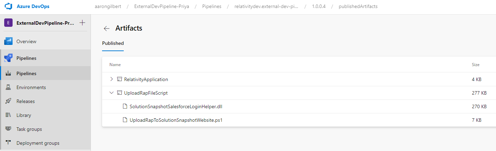
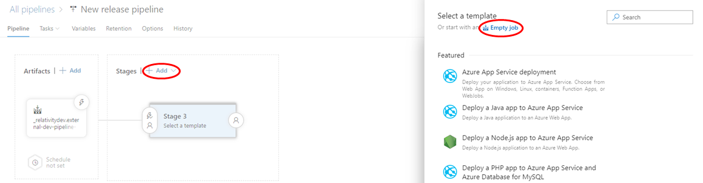
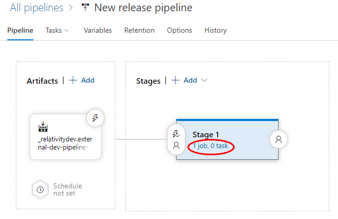

# external-dev-pipeline-repo

This is Documentation to help you get started with creating your own CI/CD pipeline for testing and building Relativity Applications!

## What is Azure Pipelines?
- Azure Pipelines is a cloud service that you can use to automatically build and test your code project and make it available to other users. It works with just about any language or project type.
- Azure Pipelines combines continuous integration (CI) and continuous delivery (CD) to constantly and consistently test and build your code and ship it to any target.

### Does Azure Pipelines work with my language and tools?
#### Languages
You can use many languages with Azure Pipelines, such as Python, Java, JavaScript, PHP, Ruby, C#, C++, and Go.
#### Version control systems
Before you use continuous integration and continuous delivery practices for your applications, you must have your source code in a version control system. Azure Pipelines integrates with GitHub, GitHub Enterprise, Azure Repos Git & TFVC, Bitbucket Cloud, and Subversion.
#### Application types
You can use Azure Pipelines with most application types, such as Java, JavaScript, Node.js, Python, .NET, C++, Go, PHP, and XCode.
#### Deployment targets
Use Azure Pipelines to deploy your code to multiple targets. Targets include container registries, virtual machines, Azure services, or any on-premises or cloud target.
#### Package formats
To produce packages that can be consumed by others, you can publish NuGet, npm, or Maven packages to the built-in package management repository in Azure Pipelines. You also can use any other package management repository of your choice.

### What do I need to use Azure Pipelines?
To use Azure Pipelines, you need:
- An organization in Azure DevOps.
- To have your source code stored in a version control system

## How to use Azure Pipelines
You define your pipeline mostly in code in a YAML file alongside the rest of the code for your app.
- The pipeline is versioned with your code and follows the same branching structure. You get validation of your changes through code reviews in pull requests and branch build policies.
- Every branch you use can modify the build policy by modifying the azure-pipelines.yml file.
- A change to the build process might cause a break or result in an unexpected outcome. Because the change is in version control with the rest of your codebase, you can more easily identify the issue.

The basic steps are these:
1. Configure Azure Pipelines to use your Git repo.
2. Edit your azure-pipelines.yml file to define your build.
3. Push your code to your version control repository. This action kicks off the default trigger to build and deploy and then monitor the results.
4. Your code is now updated, built, tested, and packaged. It can be deployed to any target.

For more info: https://docs.microsoft.com/en-us/azure/devops/pipelines/get-started/pipelines-get-started?view=azure-devops

## Create your pipeline
### Prerequisites
- A GitHub account, where you can create a repository. If you don't have one, you can create one for free.
- An Azure DevOps organization. If you don't have one, you can create one for free. (An Azure DevOps organization is different from your GitHub organization. Give them the same name if you want alignment between them.) If your team already has one, then make sure you're an administrator of the Azure DevOps project that you want to use.
### Setup your first *azure-pipelines.yml* file
1. Sign in to your Azure DevOps organization and navigate to your project.
2. In your project, navigate to the Pipelines page. Then choose the action to create a new pipeline.
3. Walk through the steps of the wizard by first selecting GitHub as the location of your source code.
4. You might be redirected to GitHub to sign in. If so, enter your GitHub credentials.
5. When the list of repositories appears, select your desired sample app repository.
6. Azure Pipelines will analyze your repository and choose the ASP.NET pipeline template. Select Save, then select Create a new branch for this commit with the branch name azure-pipelines. Uncheck Start a pull request. **NOTE**: This will be the branch that you will continue to work off of.
### Understand the *azure-pipelines.yml* file
A pipeline is defined using a YAML file in your repo. Usually, this file is named azure-pipelines.yml and is located at the root of your repo.
- Navigate to the Pipelines page in Azure Pipelines and select the pipeline you created.
- Select Edit in the context menu of the pipeline to open the YAML editor for the pipeline. Examine the contents of the YAML file.

This pipeline runs whenever your team pushes a change to the master branch of your repo. This pipeline restores the NuGet packages for the solution, builds the solution, and then runs the tests for the solution.

For more info: https://docs.microsoft.com/en-us/azure/devops/pipelines/customize-pipeline?view=azure-devops

## Customize Azure Pipelines to be a Relativity Rap File CI/CD
You can add additional scripts or tasks as steps to your pipeline. A task is a pre-packaged script. You can use tasks for building, testing, publishing, or deploying your app.

A list of tasks you can add to your pipeline can be found here: https://docs.microsoft.com/en-us/azure/devops/pipelines/tasks/?view=azure-devops .

**NOTE**: For the full example .yml file you can view the azure-pipelines.yml file in this repository [here](azure-pipelines.yml).

We're going to walk through some common tasks that we believe a solid CI/CD pipeline for Relativity RAP files should have. The tasks which we have created are:

- Create New Variable Groups
- Create New Azure Key Vault Variable Group
- Restore NuGet Packages
- Build Repository
- Run Unit Tests
- Run Integration Tests
- Run Rap Builder to create Rap File
- Publish Rap File to Azure Pipelines
- Create a Release Pipeline to Push the created Rap file to the Solution Snapshot Website.

**NOTE**: that you may use any combination of these tasks which make sense for your development needs.
You can copy the code which we show or add tasks manually using the built in Tasks explorer, seen here when editing your pipeline:

Make sure that when you are editing the azure-pipelines.yml file that you are on the azure-pipelines branch:

### New Variable Group
One of the first things we want to do is set up a Variable group. To do this click on your pipeline and select the Library tab.

On this page, click *+ Variable Group*.

As you can see below we have created 4 varaibles:
- *applicationGuid* - This is the Guid of our Relativity Application
- *buildVersion* - The current master version of the Relativity Application. 
- *salesforceUsername* - Your community account username
- *salesforcePassword* - Your community account password

**NOTE**: *applicationGuid*, *salesforceUsername*, and *salesforcePassword* will only be used if you would like to Upload a created RAP file to the Solution Snapshot Website.

Next you want to link this Variable Group to your pipeline. In the Pipelines tab click on your pipeline and then click the *Edit* button.

Click the three dot dropdown and select *Triggers*.

Click the *Variables* tab, then *Variable Groups* and select *Link variable group*. Next, select the Variable Group that we created.

Lastly, remember to Save.

### New Azure Key Vault Variable Group
Adding Azure Key Vault Secrets to a Variable Group is very similar to adding a variable group. 
- Instead of adding in every secret manually, you can choose the *Link secrets from an Azure key vault* as variables option.
- Next, you specify the Azure subscription where the key vault you want to use has been created and select the Key vault name.
- You may have to authorize your azure pipeline to access your subscription and key vault 
- Now when you add variables you can choose which key vault secrets you would like to include as variables in the variable group
- After adding the variables, save and make sure you link the variable group to your pipeline like how we did above.

### Initial *azure-pipelines.yml* Setup
There are few things needed in our azure-pipelines.yml file. First let's take a look at the top of our file:

Let's dig into these individual sections deeper:
- *trigger* - this specifies what branches to kick off a build when new code is pushed to those branches.
  - we have this set to master and develop
  - this can be set to none if you don't want it to run on any branch
- *pr* - this specifies what branches to kick off a build when a pull request is made to merge into this branch.
  - we have this set to develop so that a build for a pr only happens for a pr into develop
  - this can be set to none if you don't want it to run on any branch
- *pool*
  - vmImage - this is the virtual machine image that the pipeline will run on
    - We have this set to the latest windows image
- *variables* - local variables to be used in the pipeline. 
  - The variables solution, buildPlatform, and buildConfiguration are automatically provided.
  - The block of code below sets the developAbbreviation and buildCounter variables based on whether the build is running on the master branch or not.
  - If the branch is master than we set both variables to empty strings
  - If the branch is not master then we set the developAbbreviation to "-DEV-" and buildCounter to a counter that increases on every build that is not on master
    - The counter resets every time the buildVersion variable is changed
    
- *name* - this sets the name of build
  - We are setting the name to $(buildVersion)$(developAbbreviation)$(buildCounter)
    - So when the build is on master branch it will look like 1.0.0.0
    - When the build is not on master branch it will look like 1.0.0.0-DEV-1
  - Notice that $(buildVersion) is a reference to the buildVersion variable from our variable group that we created earlier.
  
### Restore Nuget Packages (Task name: NuGet)
The first task in our pipeline which we want to look at is Restoring Nuget packages. This is a fairly simple task and is provided automatically when you create a new pipeline. Here is the Restore Nuget Packages task:

- Inputs:
  - *restoreSolution* - The path to the solution, packages.config, or project.json file that references the packages to be restored.
  
### Build Solution (Task name: Visual Studio build)
The next task in our pipeline is Building our Solution. This is another task is provided automatically when you create a new pipeline. Here is the Build Solution task:

- Inputs:
  - *solution* - This is the path of the .sln file in our repository.
  - *msbuildArgs* - Additional arguments to MSBuild.
  - *platform* - Specifies the build platform that we are using. Specify the platform you want to build such as  Win32, x86, x64, or Any CPU.
  - *configuration* - Specifies the build configuration that we are using. Specify the configuration you want to build such as *debug* or *release*.

### Run Unit Tests (Task name: Visual Studio Test)
A common task needed in CI/CD pipelines is to run Unit Tests. This can be done with the Visual Studio Test task. Here is the Run Unit Tests task:

- Inputs:
  - *testSelector* - Use this option to specify one or more test assemblies that contain your tests. You can optionally specify a filter criteria to select only specific tests.
    - you want it to be set to 'testAssemblies'
  - *testAssemblyVer2* - Run tests from the specified files. The file paths are relative to the search folder. Supports multiple lines of minimatch patterns.
    - you should set it to the path of the .dll of your unit test project. 
  - *searchFolder* -  Folder to search for the test assemblies.
    - is set to $(System.DefaultWorkingDirectory) which is the local path on the agent where your source code files are downloaded. For example: c:\agent_work\1\s
  - *distributionBatchType* - A batch is a group of tests. A batch of tests runs at a time and results are published for that batch. If the job in which the task runs is set to use multiple agents, each agent picks up any available batches of tests to run in parallel.
    - set it to 'basedOnAssembly' so tests from an assembly are batched together.

### Run Integration Tests (Task name: Visual Studio Test)
Running an integration test uses the same task as running Unit Tests in azure pipelines with a few changes. Before we get into the yml task, you have to have your integration tests in your repository set up to run with a .runsettings file to work on azure pipelines. For more information on configuring your tests using a .runsettings file, check out this link: https://docs.microsoft.com/en-us/visualstudio/test/configure-unit-tests-by-using-a-dot-runsettings-file?view=vs-2019. Once you have that set up for your repository, azure pipelines visual studio test task gives us the ability to override Test Run Parameters which are set in the .runsettings file. We created those variables in a variable group for our key vault earlier. If you are using TestHelpers for you integration tests, the variables which you need to set are:
- WorkspaceID
- TestWorkspaceName
- TestWorkspaceTemplate
- AdminUsername
- AdminPassword
- SqlUserName
- SqlPassword
- SqlServerAddress
- TestingServiceRapPath
- UploadTestingServiceRap
- RSAPIServerAddress
- RESTServerAddress
- ServerBindingType
- RelativityInstanceAddress

**NOTE**: the values for all of these variables should be in quotation marks. Ex) "value"

Here is the Run Integration Tests task:

- Inputs:
  - Same inputs as Unit Tests, except testAssemblyVer2 is pointed at integration test project .dll
  - *runSettingsFile* - Path to runsettings or testsettings file to use with the tests.
  - *overrideTestrunParameters* - Override parameters defined in the TestRunParameters section of runsettings file or Properties section of testsettings file

### Build Rap File (Task name: Command line)
To build a rap file in our pipeline we will be using a Visual Studio template called RapCreator. To download the RapCreator visual studio template visit here: https://marketplace.visualstudio.com/items?itemName=RelativityODA.RapCreator. You can also checkout the rap-builder open source project: https://github.com/relativitydev/rap-builder. After downloading and installing the visual studio template, create a new project in your repository using the template:

The AppBuilder project will include:
- application.xml file - you will export the application.xml of your actual rap in Relativity and replace the one in this project with the exported file.
- build.xml file

You need to Add References for other projects in the SampleAppBuiler app
- Right-Click References, Select Add References
- Select all the projects for you application (Agents, Event Handlers, Custom Page) and select OK

Right click SampleAppBuilder, Select Manage Nuget Packages
- Click Restore

To build the rap file we can run the kCura.RAPBuilder.exe file
- To run it call: .\kCura.RAPBuilder.exe /source:{app builder project path) /input:{build.xml path} /servertype:local /version:{rap version}
- Example path to rap after running executable: sample-application\Source\SampleAppBuilder\bin\SampleAppBuilder.rap

In our yaml file in azure pipelines, we're going to add a command line task to call the executable
Here is the Build Rap File task:

- Inputs:
  - *workingDirectory* - Specify the working directory in which you want to run the command. If you leave it empty, the working directory is $(Build.SourcesDirectory).
  - *script* - Contents of the script you want to run
  
### Push Rap File to Artifacts (Task name: Publish build artifacts)
After building our rap file, we want to publish it to our pipeline to make it accessible. We do this with the Publish build artifacts task. Here is the Push Rap File to Artifacts task:

- Inputs:
  - *PathtoPublish* - The folder or file path to publish. This can be a fully-qualified path or a path relative to the root of the repository. Wildcards are not supported.
  - *ArtifactName* - Specify the name of the artifact that you want to create. It can be whatever you want.
  - *publishLocation* - Choose whether to store the artifact in Azure Pipelines (Container), or to copy it to a file share (FilePath) that must be accessible from the build agent.
  
After the build pipeline runs you can find the published build artifact here:

## Create a Release Pipeline to push the Rap File to the Solution Snapshot Website
**NOTE**: In order to do this you must have already signed up for the Solution Snapshot Website with your Relativity Community Account

### Build Pipeline Changes: Copy and Publish Upload Script and SolutionSnapshotSalesforceLoginHelper.dll 
We want to be able to run a script to upload our newly created Rap file to the Solution Snapshot Website. First we want to add the following NuGet package to a project in the repository:
- https://www.nuget.org/packages/RelativityDev.SolutionSnapshotLoginHelper/

This is used in the script as a helper to Login to the Solution Snapshot Website.
We also want to add the following script to the root of the repository:
- [UploadRapToSolutionSnapshotWebsite.ps1](UploadRapToSolutionSnapshotWebsite.ps1)

Next, we want to add a few tasks to our pipeline. These tasks will copy/publish the Script and the .dll from the NuGet package so that we can use them in a release pipeline. First let's look at copying the files to the Artifact Staging Directory:

- Inputs:
  - *Contents* - File paths to include as part of the copy.
  - *TargetFolder* - Target folder or UNC path files will copy to.
  - *flattenFolders* - Flatten the folder structure and copy all files into the specified target folder.
  
Next we want to publish the Script Files that we just copied to the Artifact Staging Directory to a container. This is similar to what we did with publishing the Rap File artifact:

- Inputs:
- *PathtoPublish* - The folder or file path to publish. This can be a fully-qualified path or a path relative to the root of the repository. Wildcards are not supported.
- *ArtifactName* - Specify the name of the artifact that you want to create. It can be whatever you want.
- *publishLocation* - Choose whether to store the artifact in Azure Pipelines (Container), or to copy it to a file share (FilePath) that must be accessible from the build agent.

After running these tasks, you will be able to find the published Script and .dll in same place where the published rap was.

### Create Release Pipeline
Now, we want to create a release pipeline that runs after a successful build on the master branch.
This pipeline will:
- Obtain the Relativity Version of the environment which we ran our tests against by making a rest call
- Use the Relativity Version to update the compatibility of the application in the Solution Snapshot Website by calling the UploadRapToSolutionSnapshotWebsite.ps1 script 

Click on the Releases tab:

Then select New Release Pipeline (If you are asked to pick a template skip this). You will now see this screen:

There are a few pieces to note here:
- *Artifacts* - a deployable component of your application. It is typically produced through a Continuous Integration or a build pipeline
- *Stages* - Stages are the major divisions in a pipeline: "build this app", "run these tests", and "deploy to pre-production" are good examples of stages. They are a logical boundary in your pipeline at which you can pause the pipeline and perform various checks.

So in our case the artifact will be the build pipeline which we had previously create and the stages will be tasks to get the relativity version of the environment that we ran our tests against and then to call our script.

Click Add next to Artifacts to add a new artifact.
- Select source type as build
- Then choose your project and your build pipeline
- Choose the Default version and alias which make sense to your project.

Next add a new Empty Stage job:

Now that we have our stage we want to give it access to the variables in our variable group.
- Under the releases tab, go to *Variables* → *Variable groups* → *Link variable group*
- Link the Build Information variable group to the Stage that we just created:

Next click on where it says *1 job, 0 task* under the created stage:

Next add a new PowerShell task:

We'll add a task to Get the Instance Relativity Version. This will run a script that make a REST call to the Relativity Instance to return the version. The last line of this script stores the version value in a variable called *instanceRelativityVersion*. Add the following task to Get the Instance Relativity Version:

**Get Instance Relativity Version Inline script**:
--------------------------------------------------------------------------------------

$bytes = [System.Text.Encoding]::ASCII.GetBytes($(adminUsername)+":"+$(adminPassword))

$base64 = [System.Convert]::ToBase64String($bytes)

$uriString = $(serverBindingType)+"://"+$(restServerAddress)+"/relativity.rest/api/Relativity.Services.InstanceDetails.IInstanceDetailsModule/InstanceDetailsService/GetRelativityVersionAsync"

$Uri = [System.Uri]$uriString

$headers = New-Object "System.Collections.Generic.Dictionary[[String],[String]]"

$headers.Add("X-CSRF-Header", "-")

$headers.Add("Authorization", "Basic $base64")

[Net.ServicePointManager]::SecurityProtocol = [Net.SecurityProtocolType]::Tls12

$Result = Invoke-RestMethod -Uri $Uri -Method Post -ContentType 'application/json' -Headers $headers

Write-Host $Result

Write-Host "##vso[task.setvariable variable=instanceRelativityVersion;]$Result"

--------------------------------------------------------------------------------------

Next we'll add another PowerShell Task to run our script.
This task will run the Script to Upload our Rap File to the Solution Snapshot Website:

For choosing the script path you can click the 3 dots to the right of the box and choose the path based on where you published the artifacts in your build pipeline:

The arguments for the script are in the following order:
- Salesforce Community Username
- Salesforce Community Password
- Relativity Application Guid
- Relativity Application Version
- Compatible Instance Relativity Version
- Path to Relativity Application

Lastly, we want to set up the triggers for the release pipeline so that it runs after the master build runs
- For the artifact trigger it will look like the following:

- For the Stages trigger it will look like the following:

Now this will automatically kick off the release pipeline after the build pipeline passes for the master branch.

### Setting Up Github to require builds to pass on Pull Requests
- In your Github Repo, go to the Settings tab and select the Branches tab under that.
- Next, click the Add rule button under Branch protection rules.

You want to add a rule for both the develop and master branches. The rules that you want to check are:
- Require status checks to pass before merging
- Require branches to be up to date before merging
  - Then check the name of your pipeline

### Slack Notifications for Azure Pipelines
If you use Slack, you can use the Azure Pipelines app for Slack to easily monitor the events for your pipelines. Set up and manage subscriptions for builds, releases, YAML pipelines, pending approvals and more from the app and get notifications for these events in your Slack channels. You can learn more here: https://docs.microsoft.com/en-us/azure/devops/pipelines/integrations/slack?view=azure-devops
